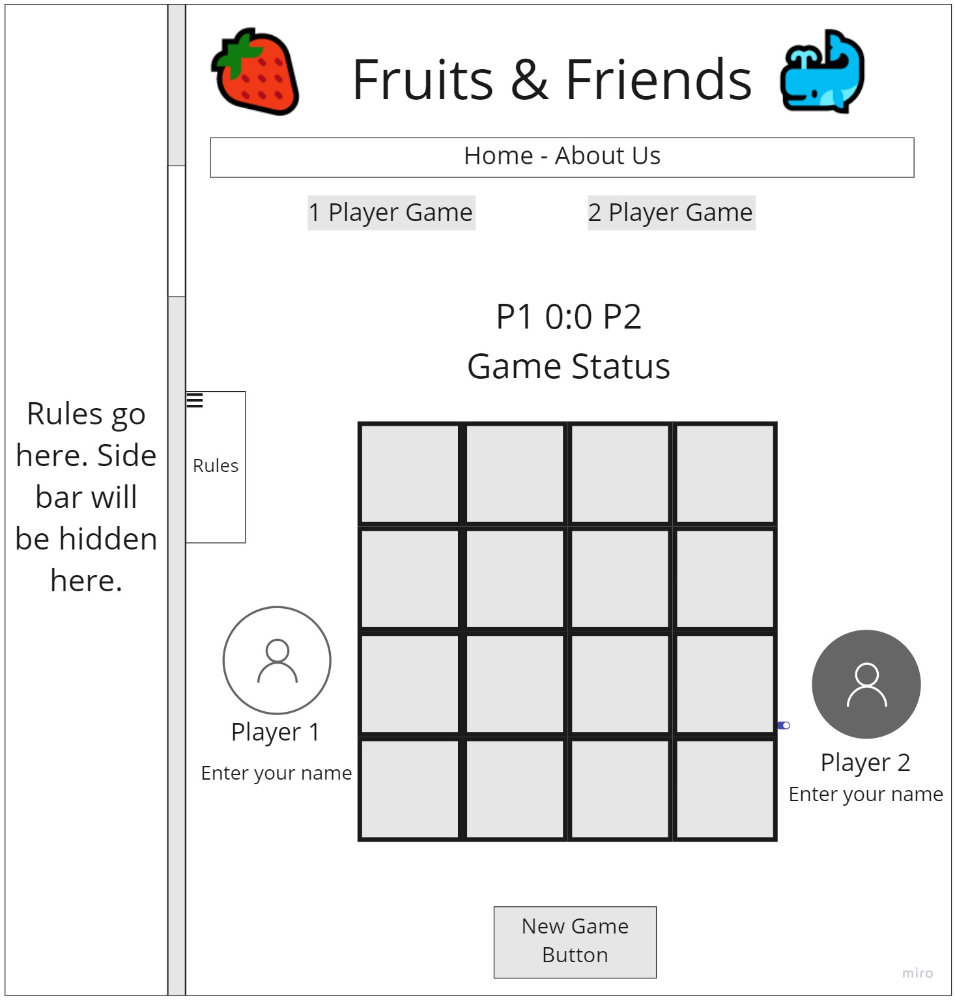
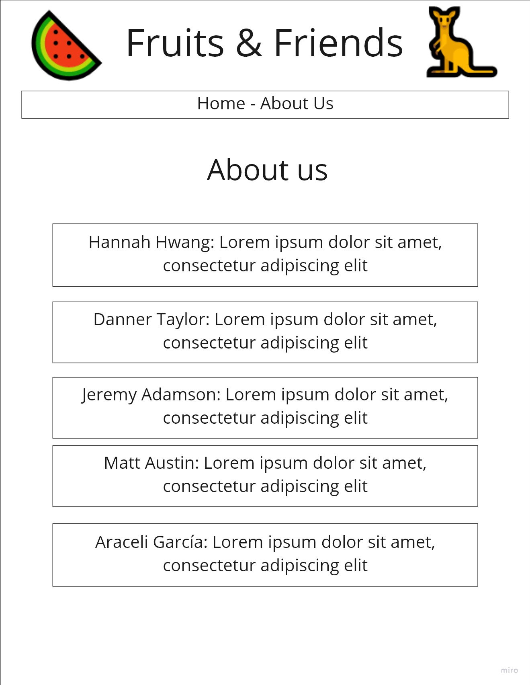
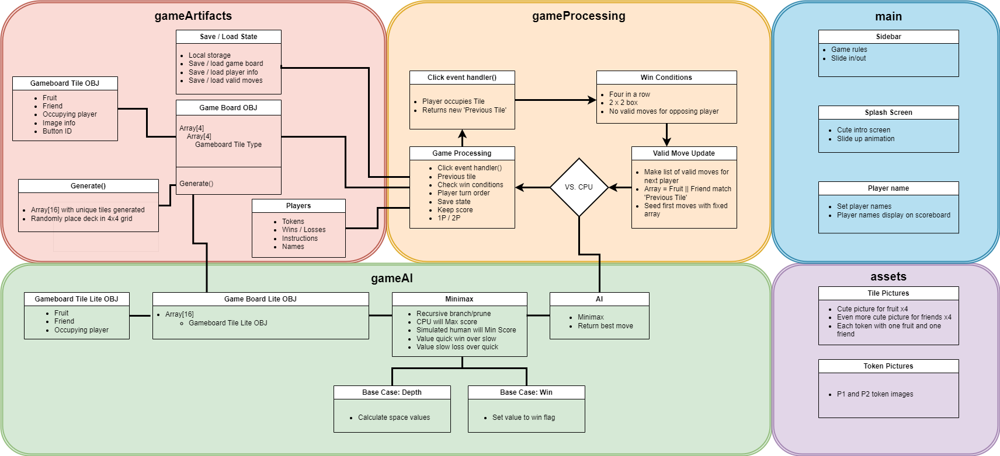

# fruits-and-friends

Fruits and Friends is a fun game between two players that takes elements of pattern matching and strategy and combines them with cute animal friends and tasty fruits!

## Object of the Game

The goal of the game is to achieve one of the following victory conditions:

- Line up your tokens in a horizontal, vertical or diagonal row.
- Arrange a 2 x 2 square of 4 tokens.
- Block your opponent so that they have no more legal moves.

## Tiles

There are 16 tiles, and each is composed of 2 elemetns, one fruit (XXX, XXX, XXX, XXX) and one animal friend (XXX, XXX, XXX, XXX). The tiles are randomly arranged in a 4x4 grid to form the game board.

## Game Play

The game is played in turns. On your turn, choose a tile to replace with one of your tokens. Set aside the tile and put the token in its place on the grid. If you are the first player, the chosen tile must be on the outside border of the game board. This is only required for the first turn of the game.

The next player must then exchange a token for a tile that shares an element in common with the tile that was just removed.

On the following turns, continue to replace tiles that have a common element with the tile removed by the previous player, while trying to arrange your tokens in one of the three victory conditions.

The first player to achieve a victory condition wins the game!

## Wireframes of Fruits and Friends

### Home Page

### About Us Page

## Project Management

[Location of Project Management Board](https://github.com/orgs/knights-of-the-project-table/projects/1)

## Domain Model

## Team Members

- Jeremy Adamson
- Matt Austin
- Hannah Hwang
- Araceli García Martínez
- Danner Taylor
